# LR6
Лабораторная работа №6

Цель лабораторной работы: изучение базовых возможностей системы управления версиями, опыт работы с Git API, опыт работы с локальным и удалённым репозиторием.

Ход работы:

Переходим по ссылке https://github.com/Kurtyanik/LR6/ В правом верхнем углу страницы нажмите кнопку "Fork". Копируем форк в локальный репозиторий:
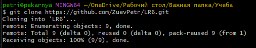
Рисунок 1 - git clone

Далее добавляем файл через через интерфейс GitHub (название файла - file_s_ud_rep.txt). Потом вытягиваем его в локальный репозиторий:
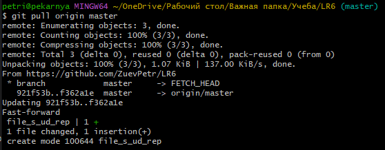
Рисунок 2 - git clone

Создаем новую ветвь:

Рисунок 3 - branch

После создаем файл в ветви, проверяем с помощью git status:
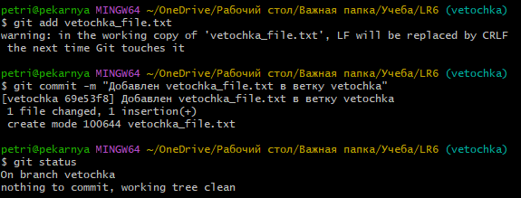
Рисунок 4 - branch_file

Также сам файл можно проверить с помощью Git Show
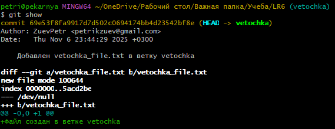
Рисунок 5 - проверка branch_file

Создаем файл с таким же названием в ветви master (для конфликта сияния). Пытаемся сделать merge:
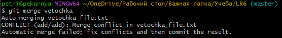
Рисунок 6 - Конфликт слияния

Теперь проверяем с помощью Git Status. На рисунке 7 видно, что конфликт вызван из-за двух одинаковых по названию файлов в разных ветвях:
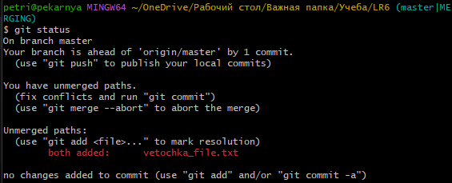
Рисунок 7 - Проверка конфликта

Заходим в файл (через блокнот, меняем его содержимое, чтобы разрешить конфликт), делаем commit:
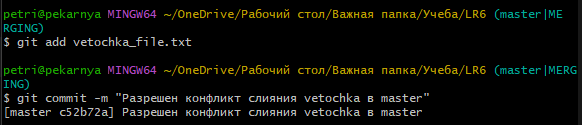
Рисунок 8 - Разрешение конфликта

Удаляем ненужную ветвь,проверяем:
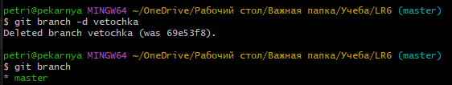
Рисунок 9 - Удаление ветви

Делаем серию коммитов:
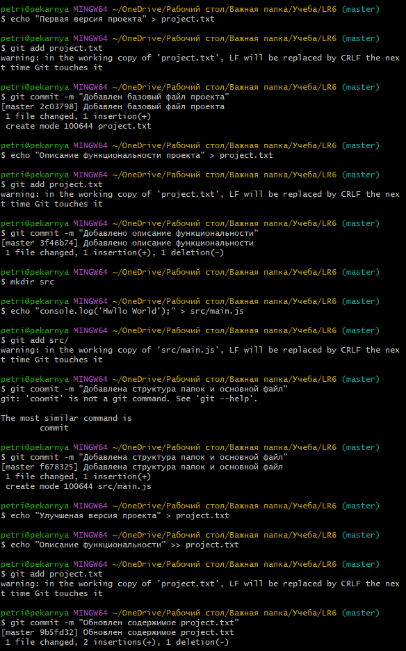
Рисунок 10 - Серия коммитов

Проверяем результат:
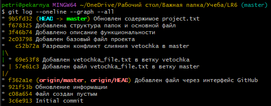
Рисунок 11 - Проверка результата создания коммитов

Удаляем последний коммит с помощью revert:
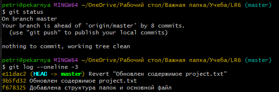
Рисунок 11 - результат удаления коммита

Далее создаем папку со скриншотами, работаем над отчетом, делаем коммит