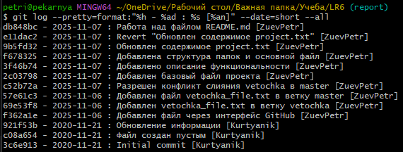

# LR6
Лабораторная работа №6

**Цель лабораторной работы:** изучение базовых возможностей системы управления версиями, опыт работы с Git API, опыт работы с локальным и удалённым репозиторием.

## Ход работы:

Переходим по ссылке https://github.com/Kurtyanik/LR6/ В правом верхнем углу страницы нажмите кнопку "Fork". Копируем форк в локальный репозиторий:

<div align="center">

<p>Рисунок 1 - git clone</p>
</div>

Далее добавляем файл через через интерфейс GitHub (название файла - file_s_ud_rep.txt). Потом вытягиваем его в локальный репозиторий:

<div align="center">

<p>Рисунок 2 - git pull</p>
</div>

Создаем новую ветвь:

<div align="center">

<p>Рисунок 3 - Создание ветки</p>
</div>

После создаем файл в ветви, проверяем с помощью git status:

<div align="center">

<p>Рисунок 4 - Создание файла в ветке</p>
</div>

Также сам файл можно проверить с помощью Git Show:

<div align="center">

<p>Рисунок 5 - Проверка branch_file</p>
</div>

Создаем файл с таким же названием в ветви master (для конфликта сияния). Пытаемся сделать merge:

<div align="center">

<p>Рисунок 6 - Конфликт слияния</p>
</div>

Теперь проверяем с помощью Git Status. На рисунке 7 видно, что конфликт вызван из-за двух одинаковых по названию файлов в разных ветвях:

<div align="center">

<p>Рисунок 7 - Проверка конфликта</p>
</div>

Заходим в файл (через блокнот, меняем его содержимое, чтобы разрешить конфликт), делаем commit:

<div align="center">

<p>Рисунок 8 - Разрешение конфликта</p>
</div>

Удаляем ненужную ветвь, проверяем:

<div align="center">

<p>Рисунок 9 - Удаление ветви</p>
</div>

Делаем серию коммитов:

<div align="center">

<p>Рисунок 10 - Серия коммитов</p>
</div>

Проверяем результат:

<div align="center">

<p>Рисунок 11 - Проверка результата создания коммитов</p>
</div>

Удаляем последний коммит с помощью revert:

<div align="center">

<p>Рисунок 12 - Результат удаления коммита</p>
</div>

Далее создаем папку со скриншотами, работаем над отчетом, делаем коммит. После получаем историю изменений:

<div align="center">

<p>Рисунок 13 - История операций</p>
</div>

## Лог команд:

```bash
# Клонирование
git clone https://github.com/ZuevPetr/LR6.git
cd LR6

# Работа с ветками
git checkout -b vetochka
git checkout master
git merge vetochka
git branch -d vetochka

# Откат коммита
git reset --soft HEAD~1

# Отчет
git checkout -b report
mkdir screenshots
# ... работа над README.md ...
git add .
git commit -m "сообщение"
git checkout master
git merge report

# Публикация
git push origin master